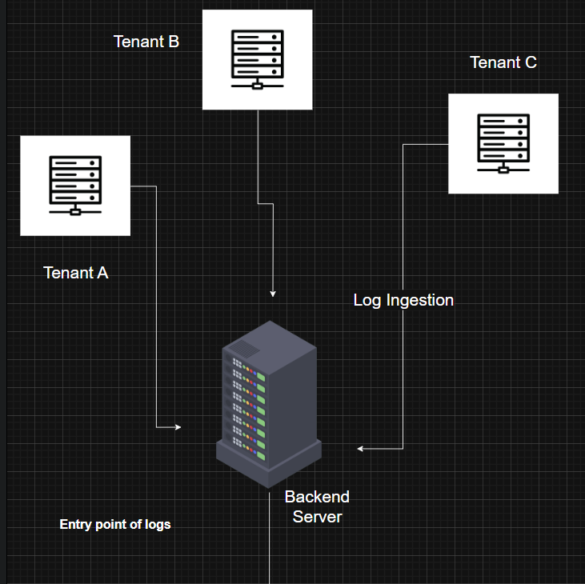
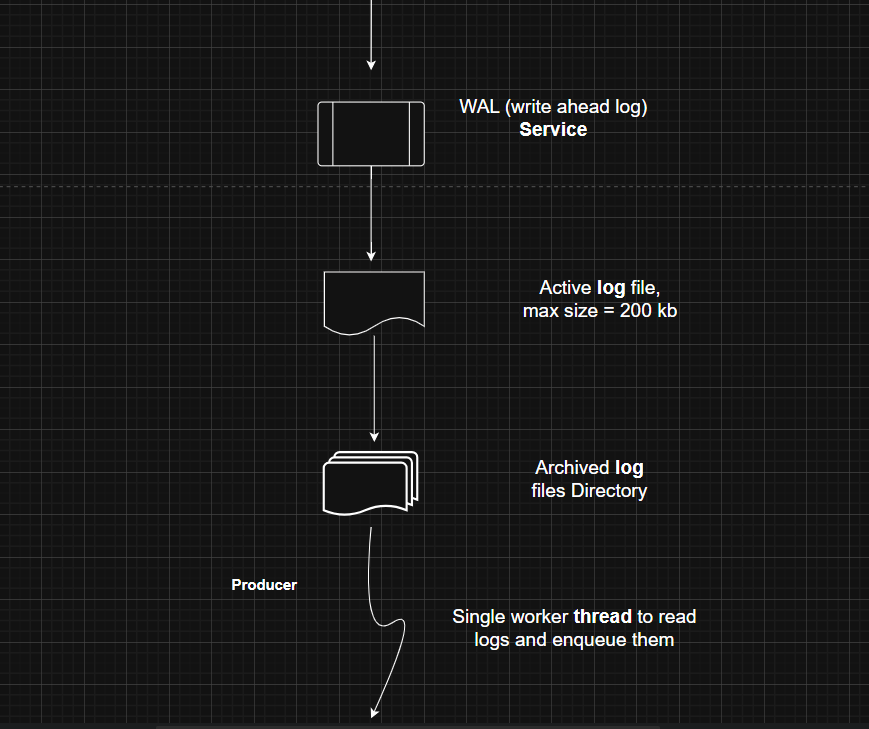
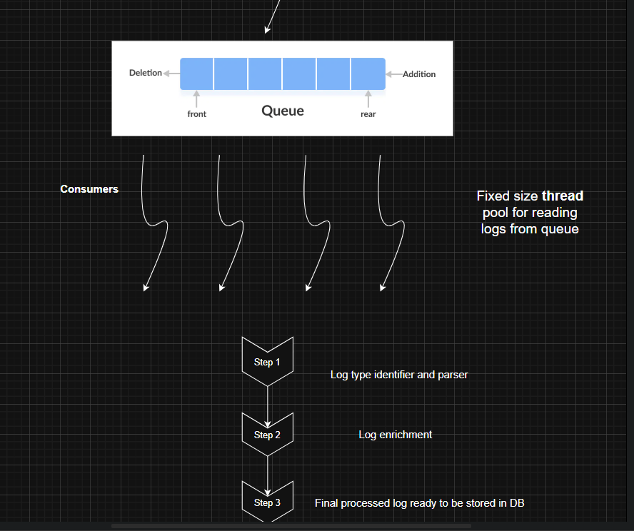
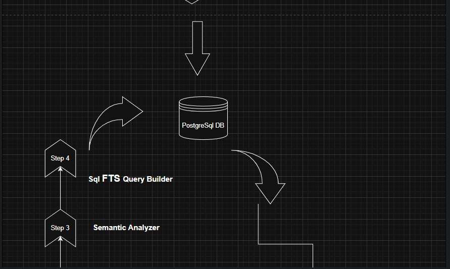
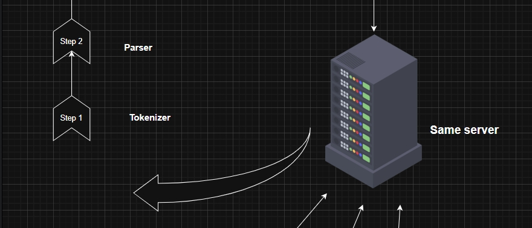
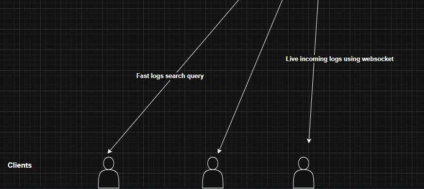

# LogFlux - Log Management & Analysis System

[](https://openjdk.java.net/)
[](https://spring.io/projects/spring-boot)
[](https://www.postgresql.org/)
[](https://www.docker.com/)
[](LICENSE)

A high-performance, log management and analysis system built with Spring Boot, PostgreSQL, and Redis. LogFlux allows you to collect, store, search, and analyze log data in real-time with advanced querying capabilities using LSQL (Log Structured Query Language).

## 📝 Supported Log Formats

> ⚠️ **IMPORTANT NOTE**: The current system fully supports only JSON and LogFMT formats. All other log types will be stored as 'default' type without advanced searching capabilities. Please format your logs in either JSON or LogFMT format for optimal functionality.

LogFlux supports two primary log formats with optimized parsing capabilities:

1. **JSON Format**
   - Fully parsed and indexed
   - Supports nested JSON structures (flattened during ingestion)
   - All fields are queryable
   
   Example:
   ```json
   {
       "service": "api-gateway",
       "level": "INFO",
       "message": "Request to /api/v1/users completed successfully",
       "hostname": "prod-gateway-7b5d",
       "clientIp": "198.51.100.24",
       // below are some examples of non indexed fields, but there values are searchable
       "http_user_agent": "Mozilla/5.0 (Windows NT 10.0; Win64; x64) AppleWebKit/537.36 (KHTML, like Gecko) Chrome/108.0.0.0 Safari/537.36",
       "trace_id": "a1b2c3d4-e5f6-7890-1234-567890abcdef",
       "request_duration_ms": 78,
       "http_status": 200
       // Additional fields will be stored in attrs JSON map
   }
   ```

2. **LogFMT Format**
   - Key-value pair format
   - Perfect for structured logging
   - Each field is parsed into a queryable attribute

   Example:
   ```
   level=INFO service=api-gateway hostname=prod-gateway-7b5d clientIp=198.51.100.24 msg="Request to /api/v1/users completed successfully" http_user_agent="Mozilla/5.0 (Windows NT 10.0; Win64; x64)..." trace_id=a1b2c3d4-e5f6-7890-1234-567890abcdef request_duration_ms=78 http_status=200
   ```

Other log formats will be stored as raw messages in the 'default' type, with limited parsing capabilities and search functionality.

## 📸 Workflow








## 🚀 Key Features

- **Real-time Log Ingestion**: High-throughput log ingestion with Write-Ahead Logging (WAL)
- **Advanced Search**: Custom LSQL query language for powerful log searching (Detailed Guide is available on Guide page)
- **Live Tail**: Real-time log streaming with WebSocket support
- **Geolocation Analysis**: IP-based geolocation tracking using MaxMind GeoIP2
- **User Agent Analysis**: Detailed user agent parsing and analysis
- **Multi-tenant Architecture**: Secure isolation between different organizations
- **Rate Limiting**: Built-in rate limiting for API endpoints
- **Authentication & Authorization**: JWT-based secure authentication system
- **Interactive Dashboard**: Real-time visualization and analytics
- **REST API**: Comprehensive API for integration
- **Redis Integration**: In-memory caching and session management

## 🛠️ Technologies

- **Backend**:
   - Java 21
   - Spring Boot 3.5.4
   - Spring Security
   - Spring WebSocket
   - Spring Data JPA
   - PostgreSQL 15
   - Redis (In-memory Cache)
   - JWT Authentication
   - MaxMind GeoIP2 (CLICK ON THE [LINK](https://www.maxmind.com/en/home) TO DOWNLOAD : GeoLite2-City_20250815.tar.gz, and place it in resources folder)
   - YAUAA (User Agent Analysis)

- **Frontend**:
   - HTML5
   - CSS3
   - JavaScript
   - WebSocket

- **DevOps**:
   - Docker
   - Docker Compose
   - k6 (Load Testing)

## 📋 Prerequisites

- Java Development Kit (JDK) 21
- Docker and Docker Compose
- Maven
- PostgreSQL 15 (if running locally, plz make sure to insert the initial query in db given in root folder i.e. **init.sql** before running the application)
- Git

## 🚀 Installation & Setup

1. **Clone the repository**
   ```bash
   git clone https://github.com/SonarAkash/Log-Management-and-Analysis-System.git
   cd Log-Management-and-Analysis-System
   ```

2. **Build the application**
   ```bash
   mvn clean package -DskipTests
   ```

3. **Set up environment variables** (Required)
   ```bash
   # Copy the example environment file
   cp .env.example .env

   # Edit .env file with your secure values
   nano .env   # or use your preferred text editor
   ```

4. **Run with Docker Compose** (Recommended)
   ```bash
   # Make sure you have created and configured your .env file first!
   docker-compose up -d
   ```

   This will start:
   - PostgreSQL database
   - LogFlux application
   - k6 load testing service (optional)

   Note: The .env file contains sensitive information and is git-ignored. Never commit it to version control!

4. **Run Locally** (Alternative)
   - Configure your PostgreSQL database
   - Update `application-dev.properties` with your database credentials
   - Run the application:
     ```bash
     mvn spring-boot:run -Dspring.profiles.active=dev
     ```

## ⚙️ Configuration

### Environment Variables

Required environment variables are defined in `.env.example`. Create your own `.env` file with actual values:

```properties
# Database Configuration
DB_USER=your_username
DB_PASSWORD=your_secure_password
DB_NAME=log_management
DB_PORT=5432

# Application Configuration
APP_PORT=8080
SPRING_PROFILE=prod
TIMEZONE=Asia/Kolkata

# Security
SECURE_KEY=your_base64_encoded_secure_key
K6_API_TOKEN=your_k6_api_token
```

## ⚠️ Important Security Notes
- Never commit the actual `.env` file to version control
- Use strong, unique passwords in production
- The `SECURE_KEY` should be a base64-encoded secret key
- Rotate the `K6_API_TOKEN` periodically
- Use different credentials for development and production environments
---

### 📂 Properties Files

- `application.properties`: Base configuration
- `application-dev.properties`: Development profile
- `application-prod.properties`: Production profile

---
## 📖 API Documentation

Access the OpenAPI documentation at:
- Local: http://localhost:8080/swagger-ui.html
- Production: https://your-domain/swagger-ui.html

## 🔍 LSQL Query Examples

1. **Basic Search**
   ```sql
   level:error AND service:payment
   ```

2. **Complex Query**
   ```sql
   service:auth AND (login OR logout) NOT clientIp:"192.168.1.5" India Mumbai
   ```

## 🧪 Running Tests

```bash
# Run all tests
mvn test

# Run specific test class
mvn test -Dtest=LogManagerApplicationTests

# Run with coverage
mvn verify
```

## 🔒 Security

- All API endpoints are secured with JWT authentication
- Rate limiting is enabled for ingestion endpoints
- Multi-tenant data isolation
- Secure WebSocket connections

## 🤝 Contributing

1. Fork the repository
2. Create your feature branch (`git checkout -b feature/AmazingFeature`)
3. Commit your changes (`git commit -m 'Add some AmazingFeature'`)
4. Push to the branch (`git push origin feature/AmazingFeature`)
5. Open a Pull Request

## 📄 License

This project is licensed under the MIT License - see the [LICENSE](LICENSE) file for details.

## 🙏 Acknowledgments

- [Spring Boot](https://spring.io/projects/spring-boot)
- [MaxMind GeoIP2](https://www.maxmind.com/en/geoip2-services-and-databases)
- [YAUAA](https://github.com/nielsbasjes/yauaa)
- [Docker](https://www.docker.com/)
- [k6](https://k6.io/)