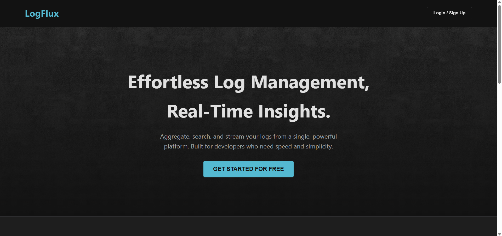
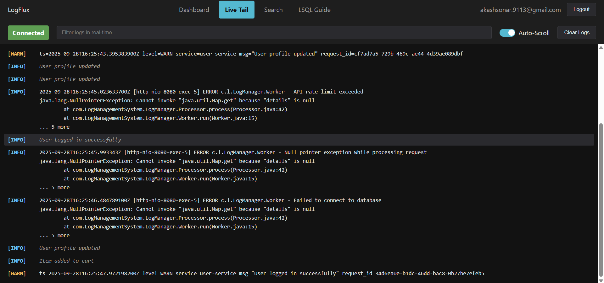
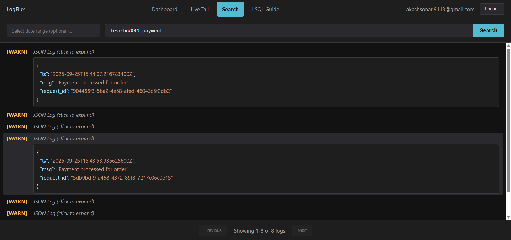

# LogFlux - Log Management & Analysis System

[](https://openjdk.java.net/)
[](https://spring.io/projects/spring-boot)
[](https://www.postgresql.org/)
[](https://www.docker.com/)
[](LICENSE)

A high-performance, log management and analysis system built with Spring Boot, PostgreSQL, and Redis. LogFlux allows you to collect, store, search, and analyze log data in real-time with advanced querying capabilities using LSQL (Log Structured Query Language).

## 📝 Supported Log Formats

> ⚠️ **IMPORTANT NOTE**: The current system fully supports only JSON and LogFMT formats. All other log types will be stored as 'default' type without advanced searching capabilities. Please format your logs in either JSON or LogFMT format for optimal functionality.

### Sending Logs to LogFlux
LogFlux provides a straightforward HTTP API for ingesting logs. Send your logs using a simple HTTP POST request to the ingest endpoint with your API key.

#### API Endpoint Details
- **URL**: `https://logflux.tech/api/v1/ingest`
- **HTTP Method**: POST
- **Authentication**: API key in HTTP header
  - Header Name: `X-Tenant-Api-Key`
  - Header Value: Your API key (obtained during setup)

LogFlux supports 2 log formats with optimized parsing capabilities:

1. **JSON Format** (Recommended)
   - Fully parsed and indexed
   - Supports nested JSON structures (flattened during ingestion)
   - All fields are queryable
   
   Example JSON payload:
    ```json
   {
     "timestamp": "2025-10-01T14:32:45Z",
     "level": "INFO",
     "service": "user-auth",
     "message": "User login successful",
     "request": {
       "ip": "192.168.1.25",
       "userAgent": "Mozilla/5.0 (Windows NT 10.0; Win64; x64)",
       "headers": {
         "content-type": "application/json",
         "accept-language": "en-US,en;q=0.9"
       }
     },
     "user": {
       "id": "u12345",
       "name": "Alice Johnson",
       "roles": ["admin", "editor"],
       "preferences": {
         "theme": "dark",
         "notifications": {
           "email": true,
           "sms": false,
           "push": true
         }
       }
     },
     "response": {
       "status": 200,
       "durationMs": 153,
       "metadata": {
         "sessionId": "sess_67890",
         "region": "us-east-1"
       }
     }
   }
   ```

   Send using curl:
   ```bash
   curl -X POST \
     https://logflux.tech/api/v1/ingest \
     -H "Content-Type: application/json" \
     -H "X-Tenant-Api-Key: YOUR_API_KEY" \
     -d '{
       "timestamp": "2025-10-01T12:30:00Z",
       "level": "INFO",
       "message": "Payment processed successfully",
       "service": "payment-service",
       "details": {"trace_id": "a1b2c3d4-e5f6"}
     }'

   Send using curl:
   ```bash
   curl -X POST \
     https://logflux.tech/api/v1/ingest \
     -H "Content-Type: application/json" \
     -H "X-Tenant-Api-Key: YOUR_API_KEY" \
     -d '{
       "timestamp": "2025-10-01T12:30:00Z",
       "level": "INFO",
       "message": "Payment processed successfully",
       "service": "payment-service",
       "details": {"trace_id": "a1b2c3d4-e5f6"}
     }'
   ```

2. **LogFMT Format**
   - Key-value pair format
   - Perfect for structured logging
   - Each field is parsed into a queryable attribute

   Example LogFMT payload:
   ```
   ts=2025-10-01T12:35:00Z level=WARN service=order-service msg="Inventory low for product" product_id=p-54321 stock=5
   ```

   Send using curl:
   ```bash
   curl -X POST \
     https://logflux.tech/api/v1/ingest \
     -H "Content-Type: text/plain" \
     -H "X-Tenant-Api-Key: YOUR_API_KEY" \
     -d 'ts=2025-10-01T12:35:00Z level=WARN service=order-service msg="Inventory low for product" product_id=p-54321 stock=5'
   ```

3. **Plain Text Format**
   - Supports unstructured log messages
   - Handles multi-line stack traces
   - Stored as raw messages with basic search capability

   Example plain text payload:
   ```
   2025-10-01T12:40:00Z [http-nio-8080-exec-1] ERROR c.a.MyService - Failed to connect to downstream service
   java.net.ConnectException: Connection refused
       at java.base/sun.nio.ch.Net.pollConnect(Native Method)
       at java.base/sun.nio.ch.Net.pollConnectNow(Net.java:672)
   ```

   Send using curl:
   ```bash
   curl -X POST \
     https://logflux.tech/api/v1/ingest \
     -H "Content-Type: text/plain" \
     -H "X-Tenant-Api-Key: YOUR_API_KEY" \
     --data-binary "2025-10-01T12:40:00Z [worker-3] ERROR - Null pointer exception while processing request"
   ```

Plain text and other non-structured formats will be stored with limited parsing capabilities and basic search functionality.

## 📸 Workflow


## 📸 Screenshots







## 🚀 Key Features

- **Real-time Log Ingestion**: High-throughput log ingestion with Write-Ahead Logging (WAL)
- **Advanced Search**: Custom LSQL query language for powerful log searching (Detailed Guide is available on Guide page)
- **Live Tail**: Real-time log streaming with WebSocket support
- **Geolocation Analysis**: IP-based geolocation tracking using MaxMind GeoIP2
- **User Agent Analysis**: Detailed user agent parsing and analysis
- **Multi-tenant Architecture**: Secure isolation between different organizations
- **Rate Limiting**: Built-in rate limiting for API endpoints
- **Authentication & Authorization**: JWT-based secure authentication system
- **Interactive Dashboard**: Real-time visualization and analytics
- **REST API**: Comprehensive API for integration
- **Redis Integration**: In-memory caching and session management

## 🛠️ Technologies

- **Backend**:
   - Java 21
   - Spring Boot 3.5.4
   - Spring Security
   - Spring WebSocket
   - Spring Data JPA
   - PostgreSQL 15
   - Redis (In-memory Cache)
   - JWT Authentication
   - MaxMind GeoIP2 (CLICK ON THE [LINK](https://www.maxmind.com/en/home) TO DOWNLOAD : GeoLite2-City_20250815.tar.gz, and place it in resources folder)
   - YAUAA (User Agent Analysis)

- **Frontend**:
   - HTML5
   - CSS3
   - JavaScript
   - WebSocket

- **DevOps**:
   - Docker
   - Docker Compose
   - k6 (Load Testing)

## 📋 Prerequisites

- Java Development Kit (JDK) 21
- Docker and Docker Compose
- Maven
- PostgreSQL 15 (if running locally, plz make sure to insert the initial query in db given in root folder i.e. **init.sql** before running the application)
- Git

## 🚀 Installation & Setup

1. **Clone the repository**
   ```bash
   git clone https://github.com/SonarAkash/Log-Management-and-Analysis-System.git
   cd Log-Management-and-Analysis-System
   ```

2. **Build the application**
   ```bash
   mvn clean package -DskipTests
   ```

3. **Set up environment variables** (Required)
   ```bash
   # Copy the example environment file
   cp .env.example .env

   # Edit .env file with your secure values
   ```

4. **Run with Docker Compose** (Recommended)
   ```bash
   # Make sure you have created and configured your .env file first!
   docker-compose up -d
   ```

   This will start:
   - PostgreSQL database
   - LogFlux application
   - k6 load testing service (optional)


4. **Run Locally** (Alternative)
   - Configure your PostgreSQL database
   - Update `application-dev.properties` with your database credentials
   - Run the application:
     ```bash
     mvn spring-boot:run -Dspring.profiles.active=dev
     ```

## ⚙️ Configuration

### Environment Variables

Required environment variables are defined in `.env.example`. Create your own `.env` file with actual values:

```properties
# Database Configuration
DB_USER=your_username
DB_PASSWORD=your_secure_password
DB_NAME=log_management
DB_PORT=5432

# Application Configuration
APP_PORT=8080
SPRING_PROFILE=prod
TIMEZONE=Asia/Kolkata

SPRING_DATA_REDIS_URL=you_redis_url   (FOR OTP)

EMAIL_API_KEY=EMAIL_API_KEY

# Security
SECURE_KEY=your_base64_encoded_secure_key
K6_API_TOKEN=your_k6_api_token
```

## ⚠️ Important Note
- The `SECURE_KEY` should be a base64-encoded secret key
---

### 📂 Properties Files

- `application.properties`: Base configuration
- `application-dev.properties`: Development profile
- `application-prod.properties`: Production profile

---
## 📖 API Documentation

Access the OpenAPI documentation at:
- Local: http://localhost:8080/swagger-ui.html
- Production: https://your-domain/swagger-ui.html

## 🔍 LSQL Query Examples

1. **Basic Search**
   ```sql
   level:error AND service:payment
   ```

2. **Complex Query**
   ```sql
   service:auth AND (login OR logout) NOT clientIp:"192.168.1.5" India Mumbai
   ```

## 🧪 Running Tests

```bash
# Run all tests
mvn test

# Run specific test class
mvn test -Dtest=LogManagerApplicationTests

# Run with coverage
mvn verify
```

## 🔒 Security

- All API endpoints are secured with JWT authentication
- Rate limiting is enabled for ingestion endpoints
- Multi-tenant data isolation
- Secure WebSocket connections

## 🤝 Contributing

1. Fork the repository
2. Create your feature branch (`git checkout -b feature/AmazingFeature`)
3. Commit your changes (`git commit -m 'Add some AmazingFeature'`)
4. Push to the branch (`git push origin feature/AmazingFeature`)
5. Open a Pull Request

## 📄 License

This project is licensed under the MIT License - see the [LICENSE](LICENSE) file for details.

## 🙏 Acknowledgments

- [Spring Boot](https://spring.io/projects/spring-boot)
- [MaxMind GeoIP2](https://www.maxmind.com/en/geoip2-services-and-databases)
- [YAUAA](https://github.com/nielsbasjes/yauaa)
- [Docker](https://www.docker.com/)
- [k6](https://k6.io/)
